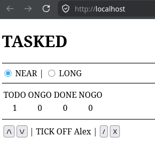

# -∞.∞.∞

"The good enough to publish, the bad enough to regret it, and the ugly duckling before a version tag"

### Added

* Container-based deployment envisioned based on professional exposure with Docker (not entirely new; virtually never really used outside of work)
* Data model designed and backend CRUDE (CRUD + Enumerate) API routes for tasks tested through Swagger (never used before)
* Static, CERN-era "ugly duckling" frontend designed and delivered via Nginx (also never used before)
* 1337 (leetspeak) and 9001 (Over 9000! meme) counts for NEAR and LONG horizons in JavaScript for testing horizon toggle
* Placeholder NEAR tasks created for testing table "design"

# 0.0.0

"The ugly duckling can sense its surroundings"

### Fixed

* Data model used SPRINT for short-term horizon while frontend scripting used NEAR; NEAR chosen to match LONG's character count (CDO FTW!); creation script updated

### Added

* First real database migration script to account for SPRINT -> NEAR change
* Frontend now displays backend tasks based on selected horizon

### Removed

* Frontend no longer shows meme counts and task placeholders (a loss for humanity - recovery uncertain)
