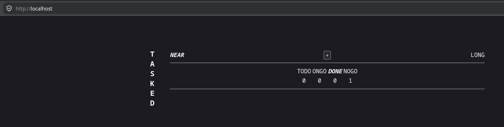

---

## The Problem

Whiteboards are great in theory. In practice:
- Short-term boards get erased monthly in quiet defeat
- Long-term boards develop archaeological layers of permanent marker
- Nothing is searchable, dated, or recoverable
- "It works on my machine" is a lifestyle, not a bug

TASKED replaces all of that with a glanceable, deployable, actually-persistent task board.

---

## The Persona

**Alex** — Solo developer, hobbyist builder, recovering whiteboard optimist.

- Monthly inbox-zero ritual, very deliberate
- Thinks in systems; execution is the gap
- Works across short-term sprints and long-horizon goals simultaneously
- Responds well to *gentle* pressure (reminders), tunes out noise
- Has a Projects directory on an external hard drive that shall not be spoken of

---

## The Produce

| Layer | Choice | Notes |
|-------|--------|-------|
| [Backend](./app) | Python + FastAPI | Lightweight, no magic |
| Database (MVP) | SQLite | File-based, trivially Dockerized |
| Database (future) | PostgreSQL | Migration is its own portfolio milestone |
| [Frontend](./web) | Vanilla HTML / CSS / JS | No frameworks-du-jour |
| [Deployment](USAGE.md) | Docker | Because "it works on my machine" is not a deployment strategy |
